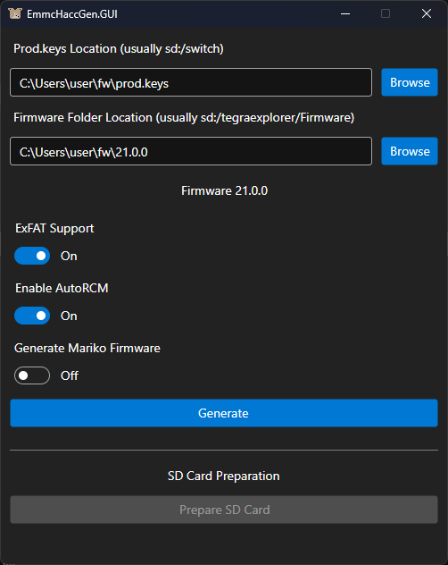

# EmmcHaccGen

Supposed to be a replacement of ChoiDujour

# How to use (GUI)

Go to the [Releases](https://github.com/suchmememanyskill/EmmcHaccGen/releases) tab to grab yourself the latest EmmcHaccGen release, download the release corresponding to your operating system and system architecture.

Select the location of `prod.keys` and your firmware dump, then toggle relevant options and click `Generate`.




# How to use (CLI)
Go to the [Releases](https://github.com/suchmememanyskill/EmmcHaccGen/releases) tab to grab yourself the latest `EmmcHaccGen.CLI` release.

```
EmmcHaccGen:
  Generates boot files for the Nintendo Switch. Generates Boot01, bcpkg2 and the 120 system save.

Usage:
  EmmcHaccGen [options]

Options:
  --keys <keys>       Path to your keyset file
  --fw <fw>           Path to your firmware folder
  --no-exfat          Disables exfat support on generated firmware when enabled. Disabled by default
  --verbose           Enable verbose output. Disabled by default
  --show-nca-index    Show info about nca's, like it's titleid and type. Will not generate a firmware folder with this option enabled
  --fix-hashes        Fix incorrect hashes in the source firmware folder. Disabled by default
  --no-autorcm        Disables AutoRcm
  --mariko            Enables mariko boot generation (and disables autorcm)
  --version           Show version information
  -?, -h, --help      Show help and usage information
```

# Credits

- Denn/Dennthecafebabe for being awesome in general and being the first in implementing imkv gen in [Vaporware](https://github.com/dennthecafebabe/vaporware) and [Pyhac](https://github.com/dennthecafebabe/pyhac), which this projects imkvdb gen is based on
- Thealexbarney for making libhac, which is used in this project.
